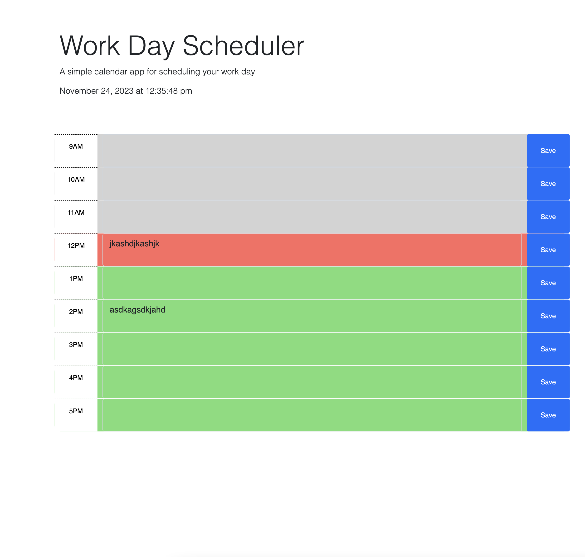

# Work-Day-Scheduler

## Description

For this project, our task was to create a simple calendar application that allows a user to save events for each hour of a typical working day (9am–5pm).

Below are the assigmemnt's requirements:

### User Story

* AS AN employee with a busy schedule
* I WANT to add important events to a daily planner
* SO THAT I can manage my time effectively

### Acceptance Criteria

* GIVEN I am using a daily planner to create a schedule
* WHEN I open the planner
* THEN the current day is displayed at the top of the calendar
* WHEN I scroll down
* THEN I am presented with time blocks for standard business hours of 9am to 5pm
* WHEN I view the time blocks for that day
* THEN each time block is color-coded to indicate whether it is in the past, present, or future
* WHEN I click into a time block
* THEN I can enter an event
* WHEN I click the save button for that time block
* THEN the text for that event is saved in local storage
* WHEN I refresh the page
* THEN the saved events persist

## How to use it

To save an event on the calendar, click on the text area input corresponding to the hour of your event, type your event or task and  save the entry by clicking on the button "Save". When you reload the page, your event should still be diplayed on the page.

Each text area input has a different color background. The color grey means that the event/hour has already past, red means that the event is currently happening and green means that it has not happened yet.

## Links

In order to complete this assignment, I have referred to a few online resources and previous assignments:

#### DayJs documentation:
* https://day.js.org/docs/en/

#### Tutor

* My tutor Wesley Clement helped me on this assignment with the local storage function.

## Screenshots

